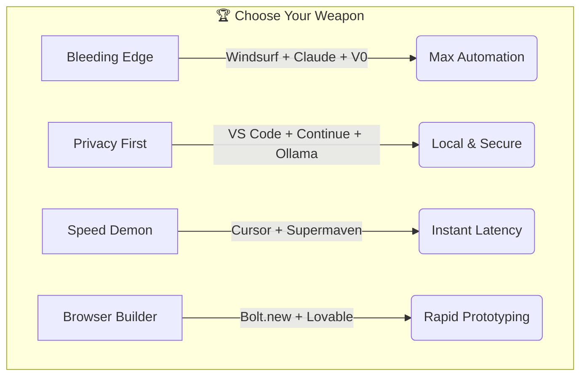

# Awesome AI Coding Tools 

> A curated list of AI-powered coding tools, agents, and extensions that are changing the way we build software.

  
   
   
  

    <a href="#ide-extensions">IDE Extensions</a> •
    <a href="#autonomous-agents">Autonomous Agents</a> •
    <a href="#chat-interfaces">Chat Interfaces</a> •
    <a href="#terminal-tools">Terminal Tools</a> •
    <a href="#code-review">Code Review</a>
  

## 🌟 Introduction

Stop drowning in AI noise. This is a filtered, high-signal toolkit for developers who want to ship code 10x faster. We track the tools that actually work—from bleeding-edge agents to privacy-focused local stacks.

## 🏆 Recommended Stacks

Don't know where to start? Try these combinations based on your needs.

| Profile | The Stack | Why? |
| :--- | :--- | :--- |
| **The "Bleeding Edge"** | **Windsurf** + **Claude 3.5 Sonnet** + **V0** | The absolute highest level of automation available today. |
| **The "Privacy First"** | **VS Code** + **Continue** + **Ollama (DeepSeek)** | 100% local, no data leaves your machine. Enterprise safe. |
| **The "Speed Demon"** | **Cursor** + **Supermaven** | Cursor for the features, Supermaven for the instant low-latency autocomplete. |
| **The "Browser Builder"** | **Bolt.new** + **Lovable** | Build full-stack apps without opening an IDE. Perfect for rapid prototyping. |

### 🧭 Visual Stack Selector

## 🧰 Resources & Templates

Don't just read about tools—use our optimized configurations.

- **[📂 System Prompts Library](prompts/system-prompts.md)** - Copy/paste these into Claude or ChatGPT for better results.
- **[📝 .cursorrules Template](templates/cursorrules-template.md)** - Drop this into your project root to make Cursor 10x smarter.
- **[🏗️ Copy-Paste Scaffolds](scaffolds/)** - "Perfect" config files for Vite/React/TS that are optimized for AI generation.
- **[⚔️ Battle of the IDEs](comparisons/ide-battle.md)** - A detailed breakdown of Cursor vs Windsurf vs Copilot vs Cline.

## 🧪 The "Advanced" Frontier

For those who want to build the future, not just use it.

- **[🔌 Model Context Protocol (MCP)](advanced/mcp-frontier.md)** - Connect AI to your Database, Git, and Local Filesystem. The new standard.
- **[🏴‍☠️ The Hacker's Guide](advanced/hackers-guide.md)** - "Grey hat" techniques for context stuffing, prompting hacks, and optimization.

## 🚀 IDE Extensions

Tools that live inside your editor (VS Code, JetBrains, etc.).

- **[GitHub Copilot](https://github.com/features/copilot)** - The OG AI pair programmer. Suggested code and entire functions in real-time.
- **[Cursor](https://cursor.sh/)** - An AI-first code editor built on top of VS Code. Features built-in chat, codebase indexing, and smart rewrites.
- **[Supermaven](https://supermaven.com/)** - Long-context code completion tool that feels incredibly fast.
- **[Codeium](https://codeium.com/)** - Free AI code completion and chat. Good alternative to Copilot.
- **[Windsurf](https://codeium.com/windsurf)** - The first "Agentic IDE" by Codeium. Deep context awareness and flows.
- **[Cline](https://github.com/cline/cline)** - (Formerly Claude Dev) Autonomous coding agent right inside VS Code.
- **[Roo Code](https://github.com/RooVetGit/Roo-Code)** - A community-driven fork of Cline with bleeding-edge features using regular updates.
- **[PearAI](https://pearai.com/)** - Open-source AI code editor alternative to Cursor.
- **[CodiumAI](https://www.codium.ai/)** - Focuses on generating meaningful tests and code analysis to prevent bugs.
- **[Continue](https://continue.dev/)** - An open-source autopilot for software development—bring your own LLM (local or cloud).

## ✨ Web AI Builders (Hot Trend)

Tools that generate full-stack web apps from a single prompt.

- **[Bolt.new](https://bolt.new/)** - StackBlitz's AI that generates, runs, and deploys full-stack apps in the browser.
- **[Lovable](https://lovable.dev/)** - "GPT Engineer" on steroids. Precise, beautiful UI generation that integrates with Supabase.

## 🤖 Autonomous Agents

Agents that can plan, execute, and debug tasks with minimal human intervention.

- **[Plandex](https://plandex.ai/)** - An open source AI coding engine for complex, multi-file tasks.
- **[Devin](https://www.cognition-labs.com/)** - The first widely publicized fully autonomous AI software engineer.
- **[OpenDevin](https://github.com/OpenDevin/OpenDevin)** - An open-source platform for autonomous AI software engineers.
- **[AutoGPT](https://github.com/Significant-Gravitas/Auto-GPT)** - One of the first experimental open-source attempts to make GPT-4 fully autonomous.
- **[Goose](https://github.com/block/goose)** - An open source AI agent that helps you build better software, faster.
- **[Sweep](https://sweep.dev/)** - AI junior developer that handles GitHub issues and pull requests (Note: discontinued but historically significant).

## 💬 Chat Interfaces

Web-based or standalone chat tools optimized for coding.

- **[ChatGPT (OpenAI)](https://chat.openai.com/)** - The most popular generic chatbot, highly capable in coding with GPT-4o.
- **[Claude 3.5 Sonnet (Anthropic)](https://claude.ai/)** - Widely considered the current SOTA for coding tasks due to its reasoning and large context window.
- **[v0.dev](https://v0.dev/)** - Generative UI system by Vercel. Describe your interface and get React/Tailwind code.
- **[Replit AI](https://replit.com/ai)** - Integrated AI coding assistant within the Replit cloud IDE.

## 💻 Terminal Tools

AI tools that live in your CLI.

- **[Warp](https://www.warp.dev/)** - A modern terminal with AI command search and assistance built-in.
- **[Wave](https://www.waverm.com/)** - Open source, cross-platform terminal built for seamless AI workflows.
- **[Aider](https://aider.chat/)** - AI pair programming in your terminal. Edits code in your local git repo.
- **[Open Interpreter](https://openinterpreter.com/)** - A natural language interface for your computer's terminal.

## 📝 Code Review & Documentation

- **[Mintlify](https://mintlify.com/)** - Automated documentation writer that analyzes your code.
- **[DeepSource](https://deepsource.io/)** - Static analysis and automated code review to fix issues before they merge.

## 🔎 AI Search Engines for Devs

Stop Googling. Use these for direct technical answers.

- **[Phind](https://www.phind.com/)** - AI search engine optimized for developers.
- **[Perplexity](https://www.perplexity.ai/)** - Great for referencing documentation and getting cited answers.
- **[Grep.app](https://grep.app/)** - (Not AI, but essential) Search across half a million git repos instantly.

## 🏠 Local LLM Runners

Run models like Llama 3 and DeepSeek locally on your machine.

- **[Ollama](https://ollama.com/)** - The easiest way to get up and running with local LLMs (Mac/Linux/Windows).
- **[LM Studio](https://lmstudio.ai/)** - Great GUI for discovering and running local models.

## 🧠 LLMs for Code

Open weights models specifically trained for coding tasks.

- **[Llama 3](https://llama.meta.com/)** - Meta's open source model, highly capable in coding tasks.
- **[StarCoder2](https://github.com/bigcode-project/starcoder2)** - Developed by BigCode, excellent for code generation.
- **[DeepSeek Coder](https://github.com/deepseek-ai/DeepSeek-Coder)** - A strong open-source model that rivals proprietary models in benchmarks.
- **[CodeLlama](https://github.com/facebookresearch/codellama)** - A family of large language models for code by Meta.

## 📚 Learning Resources

- **[Prompt Engineering Guide](https://www.promptingguide.ai/)** - Learn how to talk to these models effectively.
- **[Andrej Karpathy's "Intro to Large Language Models"](https://www.youtube.com/watch?v=zjkBMFhNj_g)** - Essential viewing for understanding the tech.

## 🤝 Contributing

Contributions are welcome! Please read the [contribution guidelines](CONTRIBUTING.md) first.

## 📜 License

[CC0 1.0 Universal](LICENSE)
